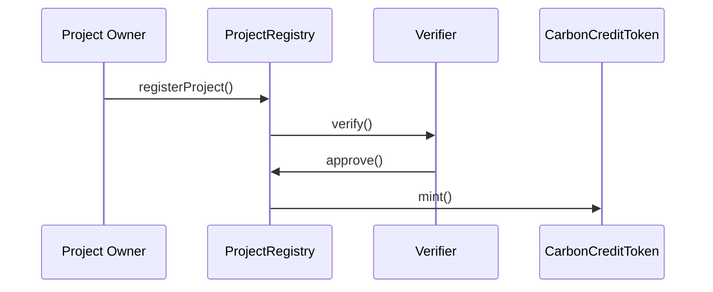
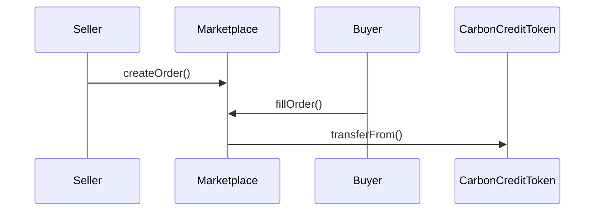

# Smart Contracts

## Overview

CarbonDAO's smart contract infrastructure is built on Ethereum and implements a comprehensive system for carbon credit trading, verification, and governance. All contracts are written in Solidity and follow best practices for security and efficiency.

## Core Contracts

### CarbonCreditToken (ERC-721)

```solidity
interface ICarbonCreditToken {
    struct CreditMetadata {
        uint256 projectId;
        uint256 amount;
        uint256 vintage;
        string verificationStandard;
        address issuer;
        uint256 expiryDate;
    }

    function mint(address to, CreditMetadata memory metadata) external;
    function burn(uint256 tokenId) external;
    function getCreditMetadata(uint256 tokenId) external view returns (CreditMetadata memory);
    function transferFrom(address from, address to, uint256 tokenId) external;
}
```

### Marketplace

```solidity
interface IMarketplace {
    struct Order {
        uint256 tokenId;
        uint256 amount;
        uint256 price;
        address maker;
        OrderType orderType;
        OrderStatus status;
    }

    enum OrderType { BUY, SELL }
    enum OrderStatus { ACTIVE, FILLED, CANCELLED }

    function createOrder(uint256 tokenId, uint256 amount, uint256 price, OrderType orderType) external;
    function cancelOrder(uint256 orderId) external;
    function fillOrder(uint256 orderId) external;
    function getOrder(uint256 orderId) external view returns (Order memory);
}
```

### ProjectRegistry

```solidity
interface IProjectRegistry {
    struct Project {
        address owner;
        string metadata;
        ProjectStatus status;
        uint256 totalCredits;
        uint256 availableCredits;
    }

    enum ProjectStatus { PENDING, APPROVED, REJECTED, SUSPENDED }

    function registerProject(string memory metadata) external;
    function approveProject(uint256 projectId) external;
    function issueCredits(uint256 projectId, uint256 amount) external;
    function getProject(uint256 projectId) external view returns (Project memory);
}
```

### Governance

```solidity
interface IGovernance {
    struct Proposal {
        uint256 id;
        address proposer;
        string description;
        bytes[] calls;
        uint256 startBlock;
        uint256 endBlock;
        uint256 forVotes;
        uint256 againstVotes;
        bool executed;
    }

    function propose(string memory description, bytes[] memory calls) external returns (uint256);
    function castVote(uint256 proposalId, bool support) external;
    function execute(uint256 proposalId) external;
    function getProposal(uint256 proposalId) external view returns (Proposal memory);
}
```

## Security Features

### Access Control

```solidity
abstract contract AccessControl {
    using EnumerableSet for EnumerableSet.AddressSet;
    
    mapping(bytes32 => EnumerableSet.AddressSet) private _roleMembers;
    mapping(bytes32 => bytes32) private _roleAdmin;

    event RoleGranted(bytes32 indexed role, address indexed account, address indexed sender);
    event RoleRevoked(bytes32 indexed role, address indexed account, address indexed sender);

    function hasRole(bytes32 role, address account) public view virtual returns (bool);
    function getRoleAdmin(bytes32 role) public view virtual returns (bytes32);
    function grantRole(bytes32 role, address account) public virtual;
    function revokeRole(bytes32 role, address account) public virtual;
}
```

### Pausable

```solidity
abstract contract Pausable {
    event Paused(address account);
    event Unpaused(address account);

    bool private _paused;

    modifier whenNotPaused() {
        require(!_paused, "Pausable: paused");
        _;
    }

    modifier whenPaused() {
        require(_paused, "Pausable: not paused");
        _;
    }

    function paused() public view virtual returns (bool) {
        return _paused;
    }
}
```

## Contract Interactions

### Trading Flow
1. Project Registration


2. Trading Process


## Error Handling

```solidity
library Errors {
    error Unauthorized();
    error InvalidAmount();
    error InsufficientBalance();
    error InvalidOrder();
    error OrderNotFound();
    error ProjectNotFound();
    error InvalidStatus();
    error AlreadyExecuted();
}
```

## Events

```solidity
interface IEvents {
    event ProjectRegistered(uint256 indexed projectId, address indexed owner);
    event CreditsMinted(uint256 indexed tokenId, uint256 amount);
    event OrderCreated(uint256 indexed orderId, address indexed maker);
    event OrderFilled(uint256 indexed orderId, address indexed taker);
    event ProposalCreated(uint256 indexed proposalId, address indexed proposer);
    event VoteCast(uint256 indexed proposalId, address indexed voter, bool support);
}
```

## Upgradability

### Proxy Pattern

```solidity
contract TransparentUpgradeableProxy {
    address private _implementation;
    address private _admin;
    
    function upgradeTo(address newImplementation) external;
    function implementation() external view returns (address);
    function admin() external view returns (address);
}
```

## Gas Optimization

### Storage Patterns
```solidity
contract OptimizedStorage {
    // Pack related variables
    struct PackedData {
        uint128 value1;
        uint64 value2;
        uint64 value3;
    }
    
    // Use mappings for sparse data
    mapping(uint256 => PackedData) private _data;
}
```

## Testing

```typescript
describe("CarbonCreditToken", () => {
    it("should mint new credits", async () => {
        const metadata = {
            projectId: 1,
            amount: 1000,
            vintage: 2024,
            verificationStandard: "VCS",
            issuer: issuerAddress,
            expiryDate: futureDate
        };
        
        await carbonCreditToken.mint(userAddress, metadata);
        const tokenMetadata = await carbonCreditToken.getCreditMetadata(1);
        
        expect(tokenMetadata.amount).to.equal(metadata.amount);
    });
});
```

## Deployment

```typescript
async function deploy() {
    const CarbonCreditToken = await ethers.getContractFactory("CarbonCreditToken");
    const Marketplace = await ethers.getContractFactory("Marketplace");
    const ProjectRegistry = await ethers.getContractFactory("ProjectRegistry");
    const Governance = await ethers.getContractFactory("Governance");

    const carbonCreditToken = await CarbonCreditToken.deploy();
    const marketplace = await Marketplace.deploy(carbonCreditToken.address);
    const projectRegistry = await ProjectRegistry.deploy(carbonCreditToken.address);
    const governance = await Governance.deploy();

    return {
        carbonCreditToken,
        marketplace,
        projectRegistry,
        governance
    };
}
```

## Audit Reports

Latest audit reports and security assessments are available at:
- [Security Audit Report](../security/audit-report-v1.0.pdf)
- [Formal Verification Report](../security/formal-verification-v1.0.pdf)